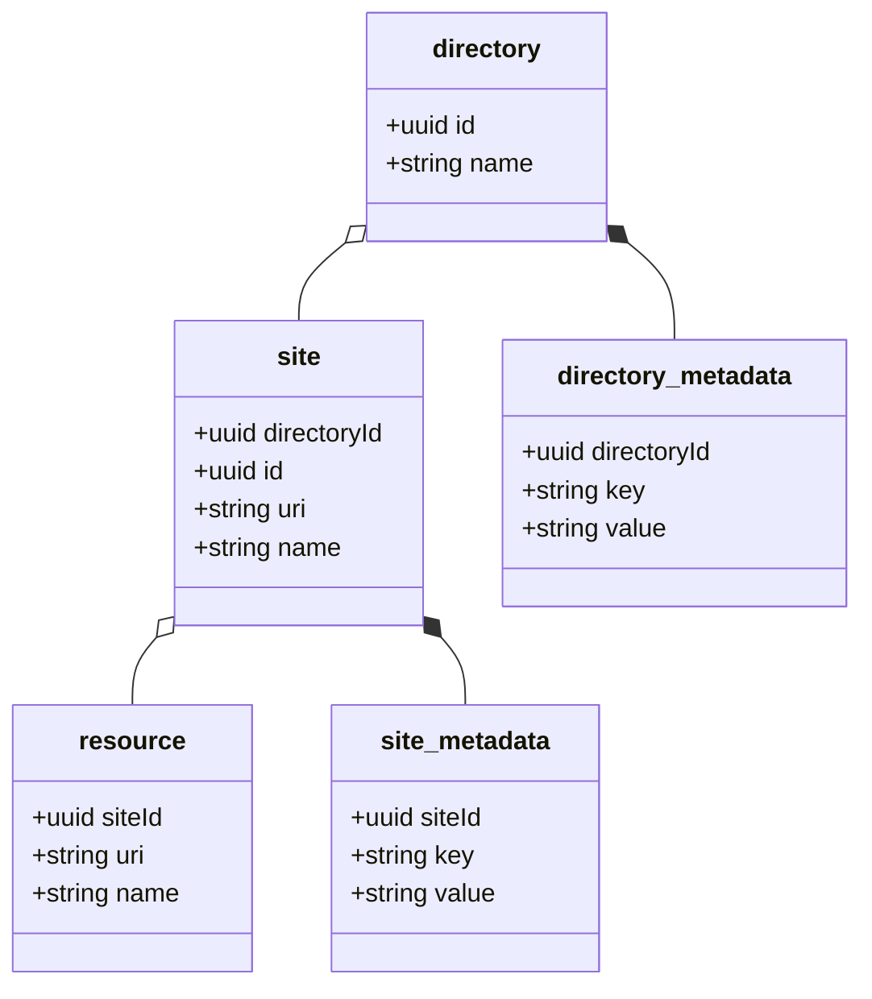

# sitewatcher2: design

## class diagram (overview)

```mermaid
classDiagram
  directory o-- site
  site o-- resource
  directory *-- directory_metadata
  site *-- site_metadata
  class directory {
    +uuid id
    +string name
  }
  class site {
    +uuid directoryId
    +uuid id
    +string uri
    +string name
  }
  class resource {
    +uuid siteId
    +string uri
    +string name
  }
  class directory_metadata {
    +uuid directoryId
    +string key
    +string value
  }
  class site_metadata {
    +uuid siteId
    +string key
    +string value
  }
```
